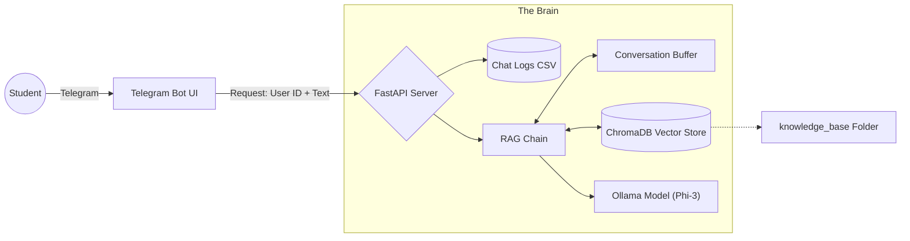

# 🤖 Italy Education Club - AI Assistant Bot


A specialized, hybrid Telegram bot designed for **Italy Education Club**. It combines a structured menu system for common queries with a powerful, **Context-Aware AI** that answers complex student questions using a local knowledge base (PDFs, CSVs, TXTs).

---

## 🌟 Key Features

* **📂 Multi-Format Knowledge Base:**
  * Dynamically ingests data from a `knowledge_base` folder.
  * Supports **PDF** (Guides), **CSV/Excel** (University lists), and **TXT** (Notes).
  * Auto-detects encoding (UTF-8 / CP1252) for Persian/English compatibility.

* **🧠 Smart Context & Memory:**
  * **Conversational Memory:** Remembers previous messages (e.g., knows what "it" refers to).
  * **Language Agnostic:** Automatically replies in the user's language (Persian 🇮🇷 or English 🇺🇸).

* **📊 Analytics & Logging:**
  * Automatically saves all User-AI interactions into `chat_history.csv` for business analysis.

* **⚡ Optimized Performance:**
  * configured to run on standard laptops using lightweight models like **Phi-3** or **Gemma**.
  * Telemetry disabled for faster startup.

---

## 🏗️ Architecture

1. **Telegram Bot (Frontend):** Handles UI, menus, and user input.
2. **FastAPI (Gateway):** Manages traffic, logs data, and routes requests to the AI engine.
3. **AI Brain (Backend):**
    * **ChromaDB:** Vectorizes documents for search.
    * **Ollama:** Generates human-like answers.
    * **Buffer Memory:** Maintains session context.



---

## 🛠️ Prerequisites

* **Python 3.10+**
* **[Ollama](https://ollama.com/)** installed.
* **RAM:** Minimum 4GB (for Phi-3) or 8GB (for Llama3).
* A Telegram Bot Token (via @BotFather).

---

## 🚀 Installation & Setup

### 1\. Setup Environment

```bash
# Clone the repo
git clone [https://github.com/your-username/italy-edu-bot.git](https://github.com/your-username/italy-edu-bot.git)
cd italy-edu-bot

# Create Virtual Env
python -m venv .venv

# Activate (Windows)
.\.venv\Scripts\activate
```

### 2\. Install Dependencies

```bash
pip install -r requirements.txt
```

### 3\. Prepare the AI Model

For standard laptops, we recommend **Phi-3** (Lightweight & Fast).

```bash
ollama pull phi3
```

*(If you have a strong server, you can use `llama3`).*

### 4\. Data Setup

1. Create a folder named `knowledge_base` in the root directory.
2. Put your files inside:
      * `guide.pdf` (Scholarship guides)
      * `universities.csv` (List of courses - **Save as CSV UTF-8**)
      * `notes.txt` (Other info)

### 5\. Configuration

Open `my_bot.py` and set your token:

```python
BOT_TOKEN = "YOUR_TELEGRAM_BOT_TOKEN"
```

Open `my_brain.py` to change the model if needed:

```python
MODEL_NAME = "phi3"  # or "llama3"
```

---

## ▶️ How to Run

You must run the **Server** and the **Bot** simultaneously in two separate terminals.

**Terminal 1: The AI Server**

```bash
# Activate venv first!
uvicorn server:app --reload
```

*Wait until you see: `✅ هوش مصنوعی آماده است!`*

**Terminal 2: The Telegram Bot**

```bash
# Activate venv first!
python my_bot.py
```

---

## 📂 Project Structure

```
italy-edu-bot/
├── .venv/                  # Virtual Environment
├── knowledge_base/         # 📂 PUT YOUR DATA FILES HERE
│   ├── guide.pdf
│   └── list.csv
├── chat_history.csv        # 📊 Generated logs (Don't delete)
├── my_bot.py               # Frontend (UI & Menus)
├── server.py               # Backend (API & Logging)
├── my_brain.py             # Logic (RAG, Memory, LangChain)
├── requirements.txt        # Dependencies
└── README.md               # Documentation
```

## 🤝 Contributing

Developed by **Hamid Lotfalian** for **Digi Mohager**.

